Gitian building
================

*Setup instructions for a gitian build of Dobbscoin using an Ubuntu VM or physical system.*

Gitian is the deterministic build process that is used to build the Dobbscoin
Core executables. It provides a way to be reasonably sure that the
executables are really built from source on GitHub. It also makes sure that
the same, tested dependencies are used and statically built into the executable.

Multiple developers build the source code by following a specific descriptor
("recipe"), cryptographically sign the result, and upload the resulting signature.
These results are compared and only if they match, the build is accepted and uploaded
to dobbscoin.org.

More independent gitian builders are needed, which is why I wrote this
guide. It is preferred to follow these steps yourself instead of using someone else's
VM image to avoid 'contaminating' the build.

Table of Contents
------------------

- [Preparing the Gitian build host](#preparing-the-gitian-builder-host)
- [Obtaining Ubuntu Server 12.04.5](#obtaining-ubuntu-server-12045)
- [Create a new VirtualBox VM](#create-a-new-virtualbox-vm)
- [Installing Ubuntu](#installing-ubuntu)
- [Connecting to the VM](#connecting-to-the-vm)
- [Restoring the package management system](#restoring-the-package-mangagement-system)
- [Setting up Ubuntu for gitian building](#setting-up-ubuntu-for-gitian-building)
- [Installing gitian](#installing-gitian)
- [Setting up gitian images](#setting-up-gitian-images)
- [Sanity check](#sanity-check)
- [Getting and building the inputs](#getting-and-building-the-inputs)
- [Building Dobbscoin](#building-dobbscoin)
- [Building an alternative repository](#building-an-alternative-repository)
- [Signing externally](#signing-externally)
- [Uploading signatures](#uploading-signatures)

Preparing the Gitian builder host
---------------------------------

The first step is to prepare the host environment that will be used to perform the Gitian builds.
This guide explains how to set up the environment, and how to start the builds.

Any kind of virtualization can be used, for example:
- [VirtualBox](https://www.virtualbox.org/), covered by this guide
- [KVM](http://www.linux-kvm.org/page/Main_Page)
- [LXC](https://linuxcontainers.org/), see also [Gitian host docker container](https://github.com/gdm85/tenku/tree/master/docker/gitian-dobbscoin-host/README.md).

You can also install on actual hardware instead of using virtualization.

In this documentation Windows 11 was used with VirtualBox 7.0 to do a Gitian Build of Dobbscoin.  I have verified identical hashsums when using Slackware 15.0 with VirtualBox 6.1.  This process can be somewhat time consuming and goes much faster if you use machines with high performance hardware.

Obtaining Ubuntu Server 12.04.5
-------------------------------
Gitian Building has become by and large replaced with other systems.  That said "BOB" still uses Gitain Building (for now).

Get the [ubuntu-12.04.5-server-amd64.iso](https://old-releases.ubuntu.com/releases/12.04/ubuntu-12.04.5-server-amd64.iso).
This DVD image can be validated using a SHA256 hashing tool, for example on
Unixy OSes by entering the following in a terminal:

    echo "af224223de99e2a730b67d7785b657f549be0d63221188e105445f75fb8305c9  ubuntu-12.04.5-server-amd64.iso" | sha256sum -c
    # (must return OK)

We will be using this as the ISO Image for the Virtual Machine.

Create a new VirtualBox VM
---------------------------
In the VirtualBox GUI click *Machine* --> *New* and choose the following parameters in the wizard:

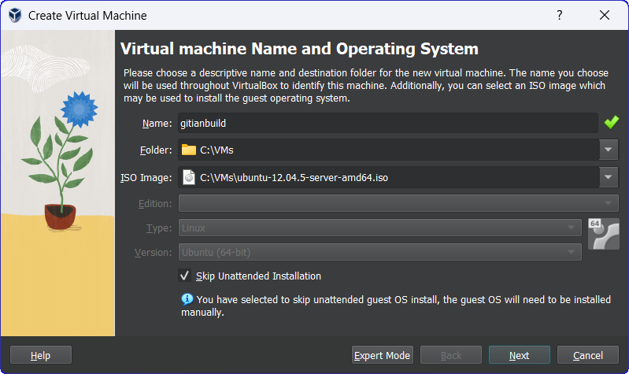

- Select `ubuntu-12.04.5-server-amd64.iso` for the *ISO Image* 
- Make sure to check *Skip Unattended Installation* if you are using VirtualBox 7.0
- Click *Next*

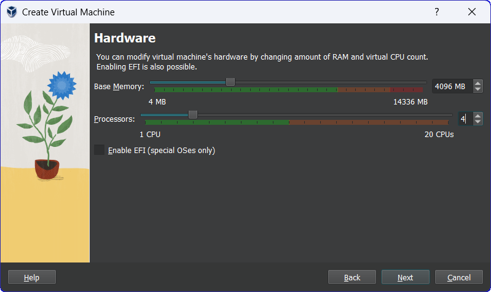

- Memory Size: at least 1024MB, anything lower will really slow the build down

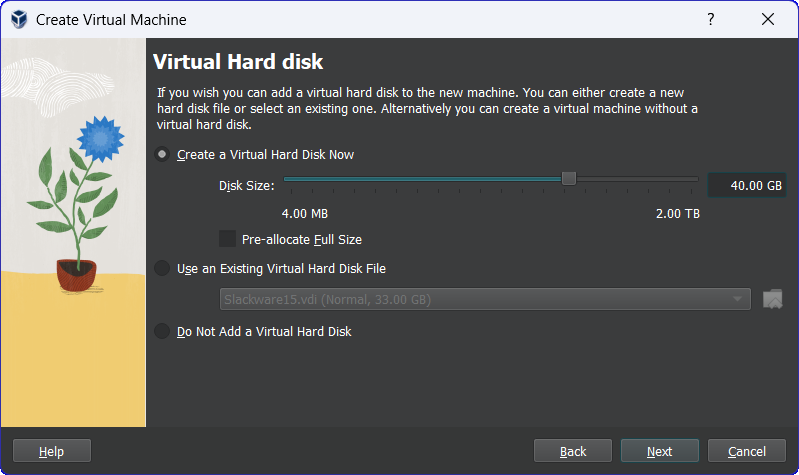

- Hard Drive: Create a virtual hard drive now
    
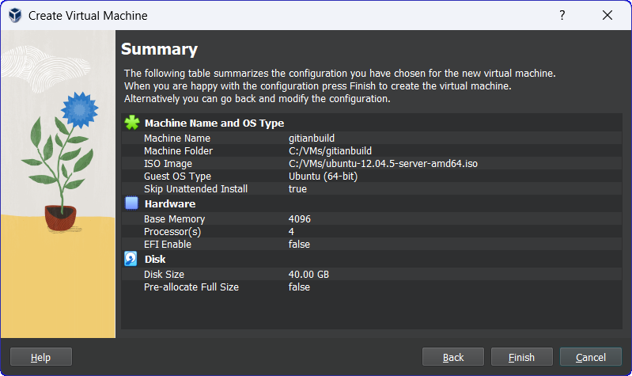

- Disk size: at least 40GB; as low as 20GB *may* be possible, but better to err on the safe side 
- Push the `Finish` button

After creating the VM, we need to configure it. 

- Click the `Settings` button, then go to the `Network` tab. Adapter 1 should be attacked to `NAT`.

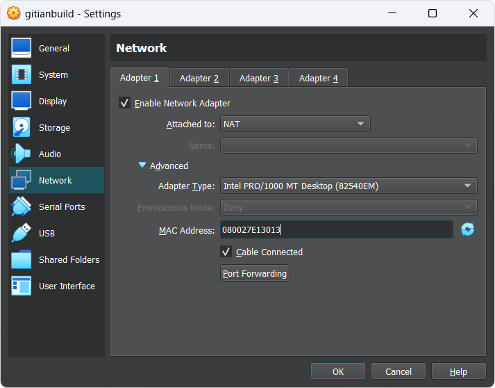

- Click `Advanced`, then `Port Forwarding`. We want to set up a port through where we can reach the VM to get files in and out.
- Create a new rule by clicking the plus icon.

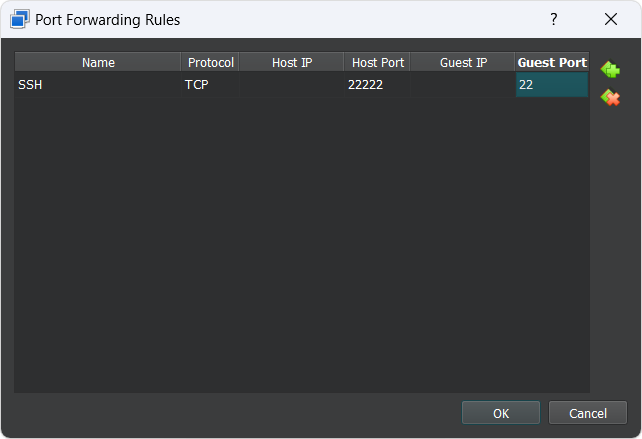

- Set up the new rule the following way:
  - Name: `SSH`
  - Protocol: `TCP`
  - Leave Host IP empty
  - Host Port: `22222`
  - Leave Guest IP empty
  - Guest Port: `22`

- Click `Ok` twice to save.

Start the VM.

Installing Ubuntu
-----------------

In this section it will be explained how to install Ubuntu Server 12.04.5 on the newly created VM.

- Choose `Install Ubuntu Server`

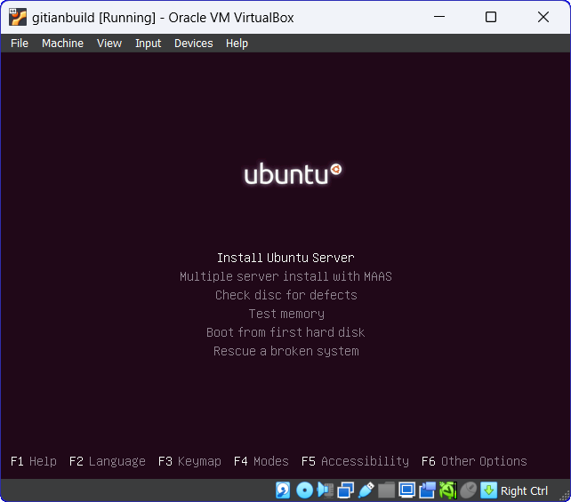

**Note**: Navigation in the Ubuntu installer: To keep a setting at the default
and proceed, just press `Enter`. To select a different button, press `Tab`.

- Choose locale and keyboard settings (doesn't matter, you can just go with the defaults or select your own information)

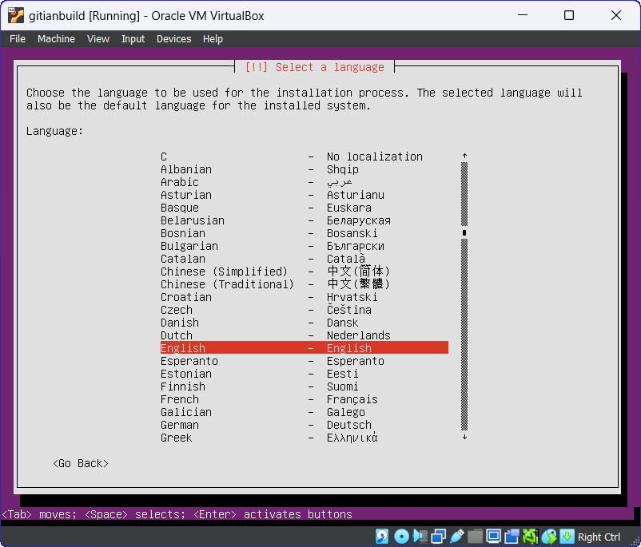
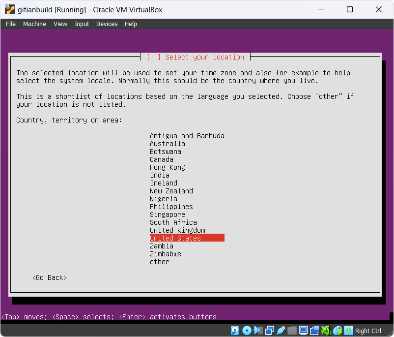
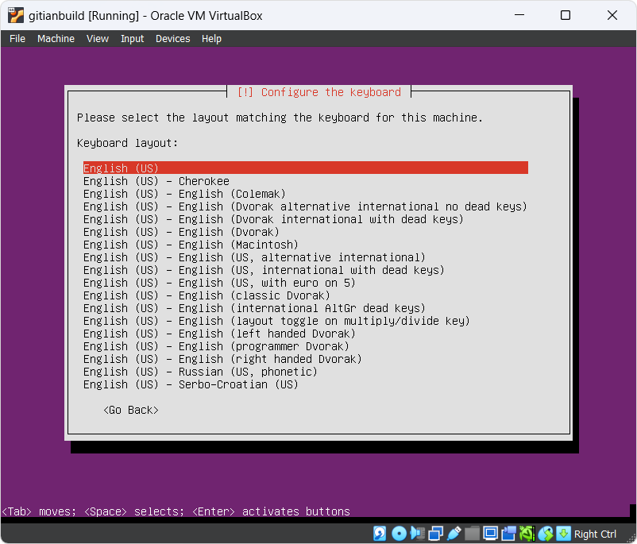

- The VM will detect network settings using DHCP, this should all proceed automatically
- Configure the network: 
  - Hostname `ubuntu`.

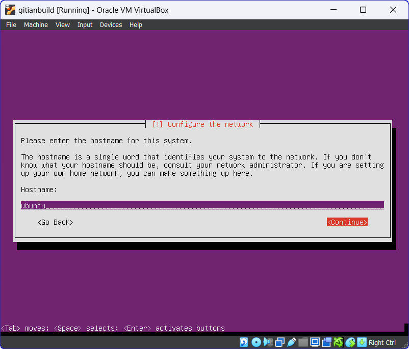

- Name the new user `ubuntu` (the full name doesn't matter, you can leave it empty) 

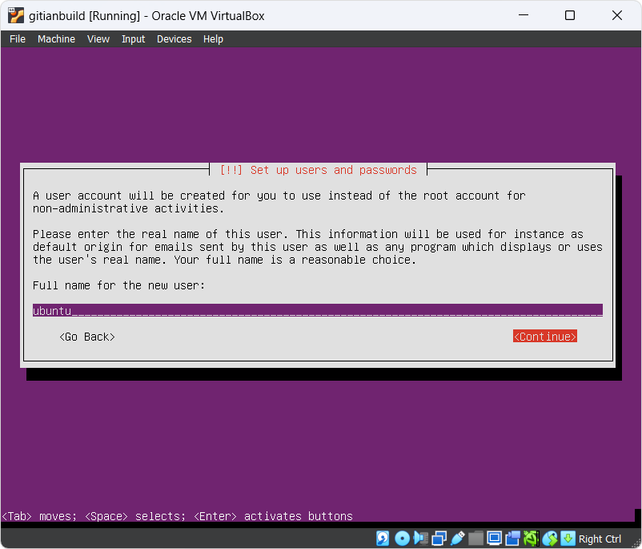
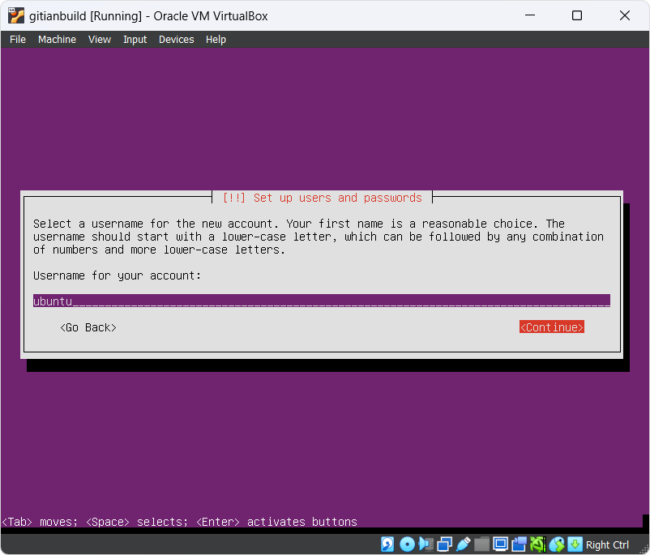

- Choose a user password and enter it twice (remember it for later) 

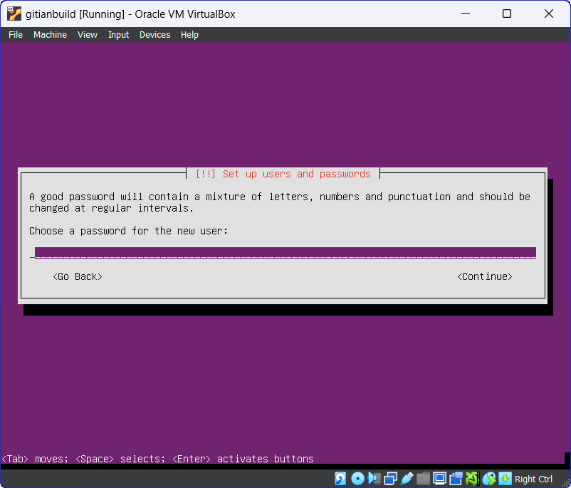

  - Select disk to partition 

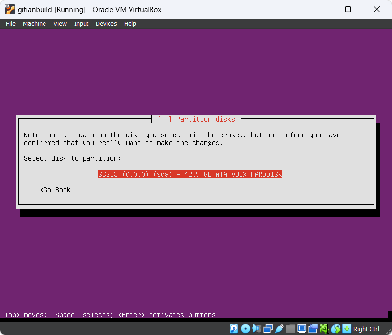

  - Partitioning scheme: use entire disk
  
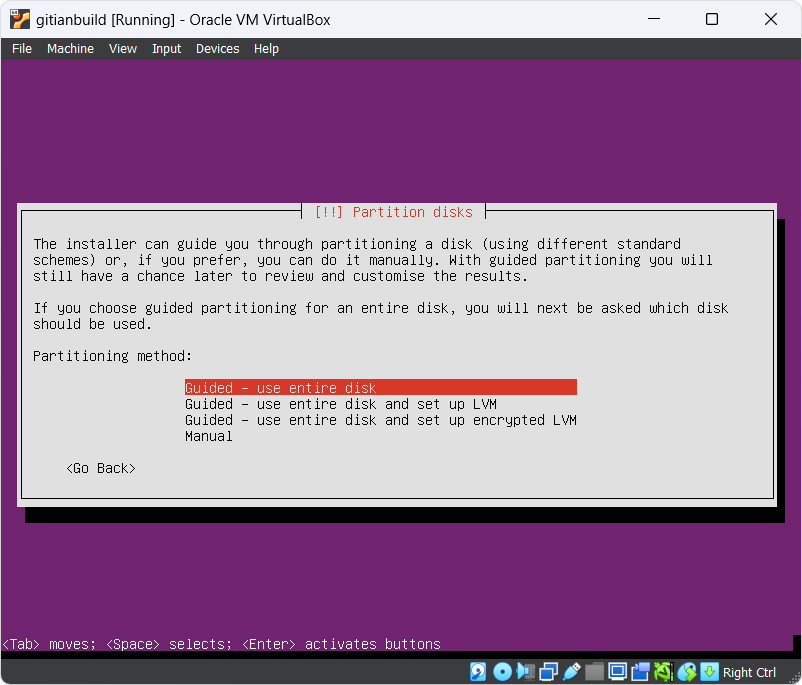

  - Finish partitioning and write changes to disk -> *Yes* (`Tab`, `Enter` to select the `Yes` button)

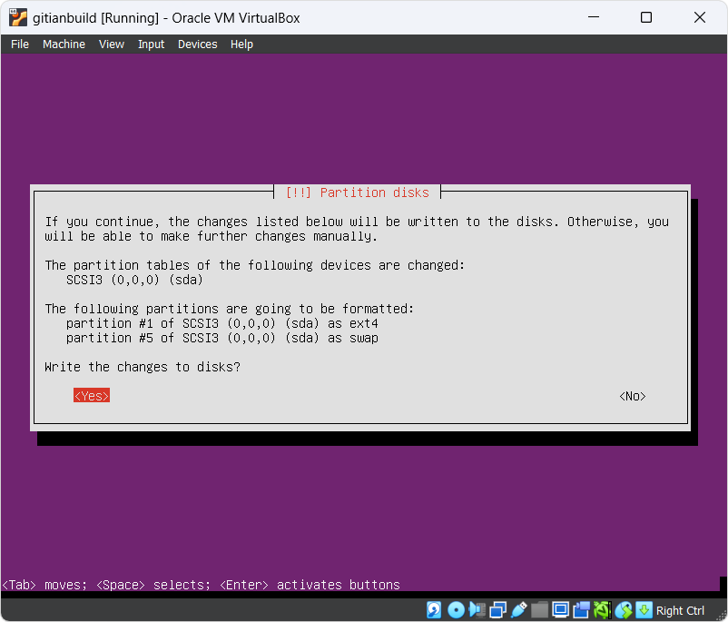 

- Enter proxy information (unless you are on an intranet, you can leave this empty)

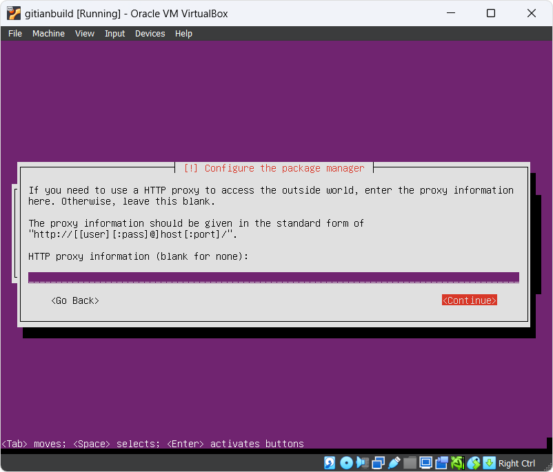

- If prompted about automatic updates be sure to check *no automatic updates*
- Make sure only `OpenSSH server` is checked then select `Continue`

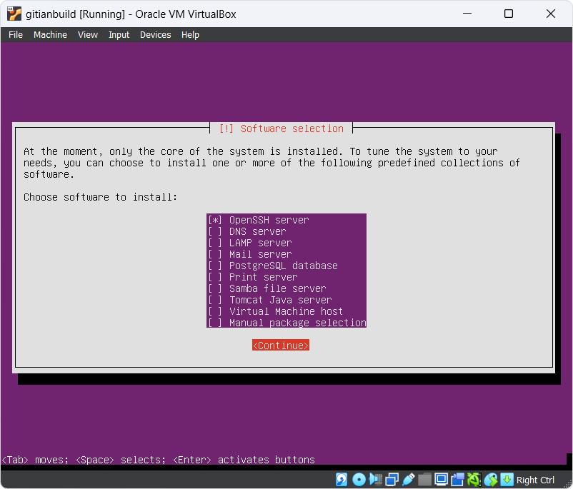

- Install the GRUB boot loader to the master boot record? -> *Yes*

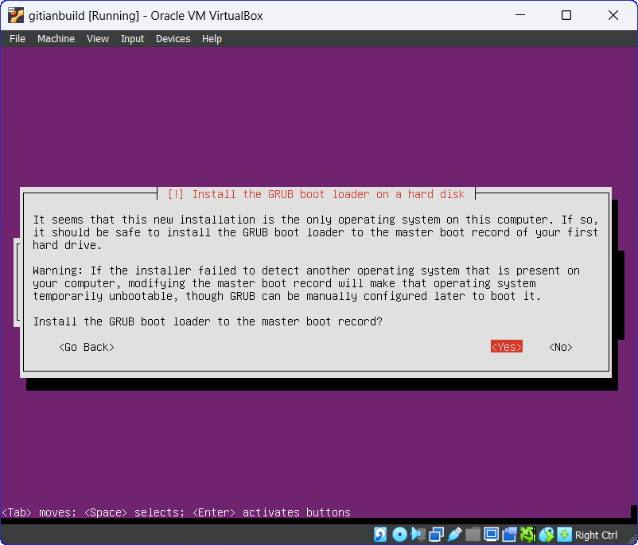

 - Installation Complete -> *Continue*

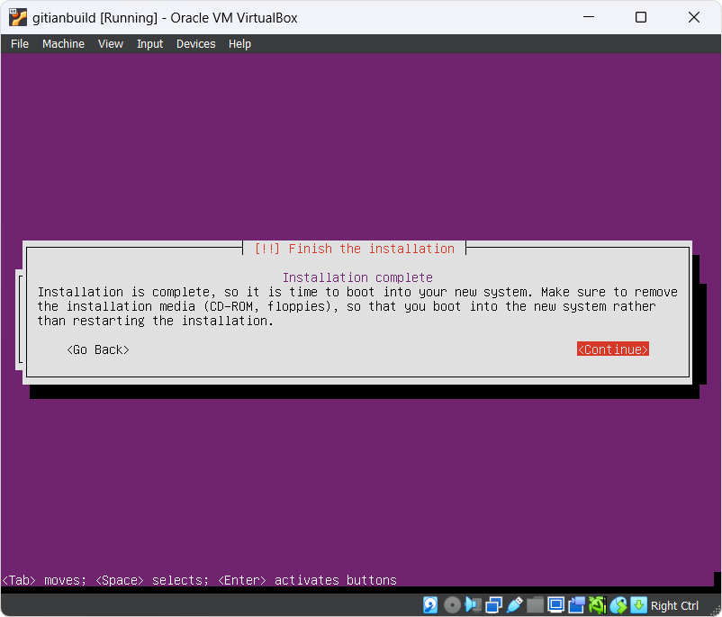

- After installation, the VM will reboot and you will have a working Ubuntu VM. Congratulations!

Connecting to the VM
----------------------

After the VM has booted you can connect to it using SSH, and files can be copied from and to the VM using a SFTP utility.
Connect to `localhost`, port `22222` (or the port configured when installing the VM).
On Windows you can use putty[1] and WinSCP[2].

For example to connect as `ubuntu` from a Linux command prompt use

    $ ssh ubuntu@localhost -p 22222
    The authenticity of host '[localhost]:22222 ([127.0.0.1]:22222)' can't be established.
    ECDSA key fingerprint is 8e:71:f9:5b:62:46:de:44:01:da:fb:5f:34:b5:f2:18.
    Are you sure you want to continue connecting (yes/no)? yes
    Warning: Permanently added '[localhost]:22222' (ECDSA) to the list of known hosts.
    ubuntu@localhost's password: (enter ubuntu user password configured during install)
    ubuntu@ubuntu:~$

[1] http://www.chiark.greenend.org.uk/~sgtatham/putty/download.html
[2] http://winscp.net/eng/index.php

Restoring the package mangagement system
----------------------------------------

While not largely publicized it is (still) possible to maintain the apt package management system on "old-releases" of Ubuntu that are no longer supported by default.

In order to do this execute the following commands

```bash
sudo sed -i 's/us.archive.ubuntu.com/old-releases.ubuntu.com/g' /etc/apt/sources.list       
sudo sed -i 's/security.ubuntu.com/old-releases.ubuntu.com/g' /etc/apt/sources.list
sudo apt-get --yes update
sudo apt-get --yes upgrade  
```

Setting up Ubuntu for gitian building
--------------------------------------

In this section we will be setting up the Ubuntu installation for Gitian building.

First we need to install some basic packages for the gitian build system to work

```bash
sudo apt-get --yes install git ruby sudo apt-cacher-ng qemu-utils debootstrap lxc python-cheetah parted kpartx bridge-utils make

```

Then set up LXC and the rest with the following, which is a complex jumble of settings and workarounds:

```bash
# system configuration
sudo su       # grants root sheel
echo "%sudo ALL=NOPASSWD: /usr/bin/lxc-start" > /etc/sudoers.d/gitian-lxc
chmod 0440 /etc/sudoers.d/gitian-lxc                   
# add cgroup for LXC
echo "cgroup  /sys/fs/cgroup  cgroup  defaults  0   0" >> /etc/fstab
exit          # exit root shell

```

```bash
# profile configuration (run as ubuntu user)
echo 'export USE_LXC=1' >> /home/ubuntu/.profile
echo 'export LXC_BRIDGE=lxcbr0' >> /home/ubuntu/.profile
echo 'export GITIAN_HOST_IP=10.0.3.1' >> /home/ubuntu/.profile
echo 'export LXC_GUEST_IP=10.0.3.5' >> /home/ubuntu/.profile
sudo reboot

```
At the end the VM is rebooted to make sure that the changes take effect. The steps in this
section need only to be performed once.

Installing gitian
------------------

Re-login as the user `ubuntu` that was created during installation.
The rest of the steps in this guide will be performed as that user.

There is no `python-vm-builder` package in Ubuntu, so we need to install it from source ourselves,

```bash
cd $HOME
wget http://archive.ubuntu.com/ubuntu/pool/universe/v/vm-builder/vm-builder_0.12.4+bzr489.orig.tar.gz
echo "ec12e0070a007989561bfee5862c89a32c301992dd2771c4d5078ef1b3014f03  vm-builder_0.12.4+bzr489.orig.tar.gz" | sha256sum -c
# (verification -- must return OK)
tar -zxvf vm-builder_0.12.4+bzr489.orig.tar.gz
cd vm-builder-0.12.4+bzr489
find . -type f -name "*py" -exec sed -i 's/archive.ubuntu.com/old-releases.ubuntu.com/g' {} \;
find . -type f -name "*py" -exec sed -i 's/security.ubuntu.com/old-releases.ubuntu.com/g' {} \;
sudo python setup.py install

```

**Note**: When sudo asks for a password, enter the password for the user *ubuntu*

Clone the git repository for gitian-builder and configure to work on current system

```bash
cd $HOME
git clone https://github.com/devrandom/gitian-builder.git
cd gitian-builder
git checkout tags/0.2
find . -type f -exec sed -i 's/archive.ubuntu.com/old-releases.ubuntu.com/g' {} \;
find . -type f -exec sed -i 's/security.ubuntu.com/old-releases.ubuntu.com/g' {} \;

```

Clone the git repository for dobbscoin-source

```bash
cd $HOME
git clone https://github.com/JimGilmore/dobbscoin-source dobbscoin

```

Setting up gitian images
-------------------------

Gitian needs virtual images of the operating system to build in.
Currently this is Ubuntu Precise for x86_64.
These images will be copied and used every time that a build is started to
make sure that the build is deterministic.
Creating the images will take a while, but only has to be done once.

Execute the following as user `ubuntu`:

```bash
cd gitian-builder
bin/make-base-vm --lxc --arch amd64 --suite precise
```

There will be a lot of warnings printed during build of the images. These can be ignored.
This will take a while to finish.  If it is successful you can go straight to 'Sanity check'
and verify if you are able to get identical hashsums.  The final executables are in the build/out directory.

**Note**: When sudo asks for a password, enter the password for the user *ubuntu*

Sanity check
------------

To actually build the binaries for different platforms and architectures enter the following commands.
All commands below are run from the `${HOME}/gitian-builder` directory.

```bash
mkdir -p inputs
make -C ../dobbscoin/depends download SOURCES_PATH=`pwd`/cache/common
# If building for OSX will have to follow the steps listed in release-process.md and move
# Mac0SX10.7.tar.gz into the inputs directory before running the /bin/gbuild script for gitian-osx.yml
# OSX cross-compile is bottleneck in process that keeps the gitian build system stuck in Ubuntu 12.04
# Has to do with the toolchain4 package which has become a legacy cross compile technique for OSX binaries

# now the process to actually start building
export SIGNER=JG  # use your name for SIGNER
export VERSION=0.10.2

./bin/gbuild --commit dobbscoin=v${VERSION} ../dobbscoin/contrib/gitian-descriptors/gitian-linux.yml

#b30a11ccd3f9ce75301adc113a92bbbc2e20eb0402e20cc81ffab42fe4ed3370  dobbscoin-0.10.2-linux32.tar.gz
#cef96f2d6b88fac10cf6aca02645c809423ba80a71984c68133d5299ac5b66b0  dobbscoin-0.10.2-linux64.tar.gz
#f4559b64c413ab58d8e7dda0709b35f374f7a1deedfbce96da4b15c7952a1eea  src/dobbscoin-0.10.2.tar.gz
#4bb00c42167714c436e3dd210c567e09486a5bd3f7ad6d8ed97d72ea6e389412  dobbscoin-linux-0.10-res.yml

./bin/gbuild --commit dobbscoin=v${VERSION} ../dobbscoin/contrib/gitian-descriptors/gitian-win.yml

#4777e1db588d9ef0571ae82e9f51c404c23889992d5bcc07d956d823673c40ca  dobbscoin-0.10.2-win32-setup.exe
#241341303d34949871384d30f09af8963d5cde272dfc9d9915ba2d0b82da7247  dobbscoin-0.10.2-win32.zip
#3b210d58b5f926bf109f894f73b66c63c0f7b2f846e38cedc34daec8efcf8733  dobbscoin-0.10.2-win64-setup.exe
#4452a0c8588319bcc2044dccc6252c070fbc96d8e11dd46fa9625389122e1356  dobbscoin-0.10.2-win64.zip
#f4559b64c413ab58d8e7dda0709b35f374f7a1deedfbce96da4b15c7952a1eea  src/dobbscoin-0.10.2.tar.gz
#25177615ef3468952a3a82a0451272bb6e3e61e183f3819e48d6bf528ae79e88  dobbscoin-win-0.10-res.yml

./bin/gbuild --commit dobbscoin=v${VERSION} ../dobbscoin/contrib/gitian-descriptors/gitian-osx.yml

#9c97b2f0699781df23c08dd86e31afae2e784079ca5d5735060cd93bd2b2472a  dobbscoin-0.10.2-osx-unsigned.dmg
#e8e6d9d4400ae26001ccd894e5c5d90da413e0e74c97fe51726a32d0a88ef4f7  dobbscoin-0.10.2-osx-unsigned.tar.gz
#c1f3ff29cd84d1db9cc14242b57034ecc439ab26a7f3320729d84cc7a4730b8a  dobbscoin-0.10.2-osx64.tar.gz
#f4559b64c413ab58d8e7dda0709b35f374f7a1deedfbce96da4b15c7952a1eea  src/dobbscoin-0.10.2.tar.gz
#32216aeff6f18f83c100d766db3d5e7de225e73012404b7ae9351c970d7eddf1  dobbscoin-osx-0.10-res.yml
```
Output binaries are in the `${HOME}/gitian-builder/build/out` directory and should be grabbed each time after running *./bin/gbuild*

Getting and building the inputs
--------------------------------

Follow the instructions in [doc/release-process.md](release-process.md) in the dobbscoin repository
under 'Fetch and build inputs' to install sources which require manual intervention. Also follow
the next step: 'Seed the Gitian sources cache', which will fetch all necessary source files allowing
for gitian to work offline.

Building Dobbscoin
----------------

To build Dobbscoin (for Linux, OSX and Windows) just follow the steps under 'perform
gitian builds' in [doc/release-process.md](release-process.md) in the dobbscoin repository.

This may take a long time as it also builds the dependencies needed for each descriptor.
These dependencies will be cached after a successful build to avoid rebuilding them when possible.

At any time you can check the package installation and build progress with

```bash
tail -f var/install.log
tail -f var/build.log

Output from `gbuild` will look something like

    Initialized empty Git repository in /home/ubuntu/gitian-builder/inputs/dobbscoin/.git/
    remote: Reusing existing pack: 35606, done.
    remote: Total 35606 (delta 0), reused 0 (delta 0)
    Receiving objects: 100% (35606/35606), 26.52 MiB | 4.28 MiB/s, done.
    Resolving deltas: 100% (25724/25724), done.
    From https://github.com/JimGilmore/dobbscoin-source
    ... (new tags, new branch etc)
    --- Building for precise x86_64 ---
    Stopping target if it is up
    Making a new image copy
    stdin: is not a tty
    Starting target
    Checking if target is up
    Preparing build environment
    Updating apt-get repository (log in var/install.log)
    Installing additional packages (log in var/install.log)
    Grabbing package manifest
    stdin: is not a tty
    Creating build script (var/build-script)
    lxc-start: Connection refused - inotify event with no name (mask 32768)
    Running build script (log in var/build.log)
```

Building an alternative repository
-----------------------------------

If you want to do a test build of a pull on GitHub it can be useful to point
the gitian builder at an alternative repository, using the same descriptors
and inputs.

For example:
```bash
URL=https://github.com/laanwj/dobbscoin.git
COMMIT=2014_03_windows_unicode_path
./bin/gbuild --commit dobbscoin=${COMMIT} --url dobbscoin=${URL} ../dobbscoin/contrib/gitian-descriptors/gitian-linux.yml
./bin/gbuild --commit dobbscoin=${COMMIT} --url dobbscoin=${URL} ../dobbscoin/contrib/gitian-descriptors/gitian-win.yml
./bin/gbuild --commit dobbscoin=${COMMIT} --url dobbscoin=${URL} ../dobbscoin/contrib/gitian-descriptors/gitian-osx.yml
```

Signing externally
-------------------

If you want to do the PGP signing on another device that's also possible; just define `SIGNER` as mentioned
and follow the steps in the build process as normal.

    gpg: skipped "laanwj": secret key not available

When you execute `gsign` you will get an error from GPG, which can be ignored. Copy the resulting `.assert` files
in `gitian.sigs` to your signing machine and do

```bash
    gpg --detach-sign ${VERSION}-linux/${SIGNER}/dobbscoin-build.assert
    gpg --detach-sign ${VERSION}-win/${SIGNER}/dobbscoin-build.assert
    gpg --detach-sign ${VERSION}-osx/${SIGNER}/dobbscoin-build.assert
```

This will create the `.sig` files that can be committed together with the `.assert` files to assert your
gitian build.

Uploading signatures
---------------------

After building and signing you can push your signatures (both the `.assert` and `.assert.sig` files) to the
[dobbscoin/gitian.sigs](https://github.com/dobbscoin/gitian.sigs/) repository, or if that's not possible create a pull
request. You can also mail the files to me (laanwj@gmail.com) and I'll commit them.
